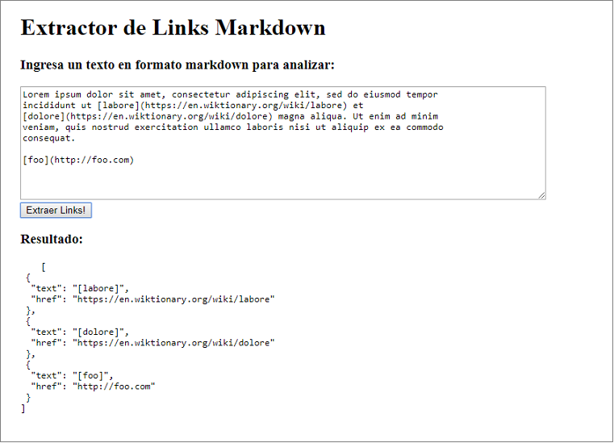

<p align="center">
	
	</img>
</p>
<p align="center">
	a markdown link extractor
</p>
<p align="center">
	<a href="https://badge.fury.io/js/linkinmark"></a>
	<a href="https://travis-ci.org/missmakita/md-links-extractor"></a>
	<a href="https://www.jsdelivr.com/package/npm/linkinmark"></a>
</p>

## Descripción
**Linkin' Mark** es un extractor de links desde formato Markdown. Puedes instalarlo como módulo en Node.js o implementarlo en tu página web.

## Instalación
### NPM
Desde la consola, posiciónate en la carpeta raíz de tu proyecto e instala el paquete npm:

    $ npm install linkinmark --save
### CDN
Utiliza el CDN de Linkin' Mark para no añadir peso a tu proyecto. Agrega este `<script>` al final del `<body>` en tu `<hmtl>`:

    <script src="https://cdn.jsdelivr.net/npm/linkinmark@1/lib/md-link-extractor.min.js"></script>
    
### Descarga directa
1. Descarga [**Linkin' Mark**](https://registry.npmjs.org/linkinmark/-/linkinmark-1.0.0.tgz) y extrae los archivos en tu computador.
2. Incorpora la carpeta `lib`, conteniendo el archivo `md-link-extractor.js`, en  la carpeta raíz de tu proyecto.
3. Asocia tu html con md-link-extractor.js, escribiendo el siguiente script al final de `<body>`:
	
	`<script src="./lib/md-link-extractor.js"></script>`

## Uso
### Node.js
1. En la carpeta raíz de tu proyecto, crea un archivo index.js , conteniendo el siguiente código, indicando la ruta del archivo markdown (*.md) a analizar:
	```
    'use strict';
    const fs = require('fs');
    const linkinmark = require('linkinkmark');
    linkinmark.extract('./<mi-archivo.md>');
2. En tu consola, posiciónate en la carpeta raíz de tu proyecto y ejecuta `index.js`:
	```
	$ node index.js
	```
3. El resultado será un objeto JSON, conteniendo cada link del archivo markdown seleccionado. Éste quedará guardado en un archivo en la carpeta `./data/mylinks.json`:
	
	```
    [
      {
        "text":"labore",
        "href":"https://en.wiktionary.org/wiki/labore"
      },
      {
        "text":"dolore",
        "href":"https://en.wiktionary.org/wiki/dolore"
      },
      {
        "text":"foo",
        "href":"http://foo.com"
      }
    ]
    ```
### Browser
La versión para páginas web, requiere sólo de unas cuantas líneas de código. Al efectuar la búsqueda, **Linkin' Mark** devolverá los resultados en un objeto JSON. Para incorporar esta herramienta en tu página, sigue los siguientes pasos:
1. Descarga [**Linkin' Mark**](https://registry.npmjs.org/linkinmark/-/linkinmark-1.0.0.tgz) o sigue las instrucciones más arriba para utilizar el enlace CDN en tu html.
2. Incorpora la carpeta `lib`, conteniendo el archivo `md-link-extractor.js`, en la carpeta raíz de tu proyecto.
3. Agrega el script al final del `body` de tu archivo `html`:
	```
	<script src="./lib/md-link-extractor.js"></script>
	<script>
      const extract = document.getElementById('extract');
      extract.onclick = function myLinks() {
        let markdown = document.getElementById('markdown').value;
        document.getElementById('result').innerHTML = markdownLinkExtractor(markdown);
      };
    </script>
#### Ejemplo HTML
Puedes seguir este ejemplo:
1. Crea un elemento `<input>` o `<textarea>` con `id="markdown"` en tu html. 
2. Agrega un botón con el `id="extract"`.
3. Por último, para poder visualizar el resultado de la búsqueda, incorpora un elemento `<pre></pre>` y un elemento `<code></code>` con `id="result"` anidado en su interior. 
	```
	<body>
	  <h1>Extractor de Links Markdown</h1>
	  <h3>Ingresa un texto en formato markdown para analizar:</h3>
	  <textarea id="markdown" cols="100" rows="10"></textarea>
	  <button id="extract">Extraer Links!</button>
	  <h3>Resultado:</h3>
	  <pre>
	    <code id="result"></code>
	  </pre>
	</body>
	```
Si decides modificar los nombres de id sugeridas, recuerda verificar que coincidan con el script.

El resultado se verá así:
<p align="center">
  
</p>

## Autoras
[Makarena Fernández](https://github.com/missmakita), [Visaka Devi](https://github.com/visidevi) y [Viviana Marcelo](https://github.com/skyblue16).

## Licencia
[MIT](LICENSE.txt)
